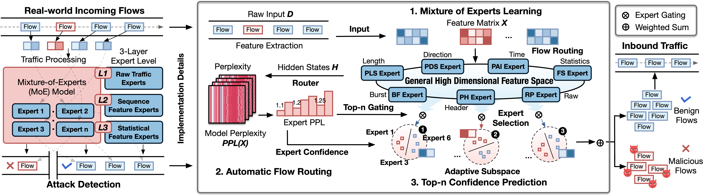

# TrafficMoE

> **Perplexity-Guided Dynamic Expert Routing for Feature-Agnostic Traffic Detection**


## Overview

This repository contains the official implementation of **TrafficMoE**, **a perplexity-guided Mixture-of-Experts (MoE) framework for feature-agnostic network intrusion detection**. Unlike existing ML-based NIDS that rely on fixed, task-specific feature spaces and degrade significantly under evasion attacks and zero-day threats, TrafficMoE dynamically routes each network flow to the most suitable experts based on model perplexity, enabling robust detection across diverse real-world traffic conditions.

<p align="center">
  
</p>


## Key Features

- 🔀 **Perplexity-Guided Routing** — Model perplexity as a universal signal to route experts by capturing subtle deviations between real-world attacks and training knowledge for each flow.
- 🧠 **Mixture-of-Experts Architecture** — Dynamically activates a subset of seven specialized experts spanning varying views of the general high-dimensional feature space.
- 🛡️ **Feature-Agnostic Detection** — Robust against diverse existing attacks, evasion attacks, and previously unseen zero-day threats through adaptively selecting the most suitable feature subspaces, outperforming state-of-the-art feature-dependent systems.

---

## Installation

Please clone the repo and install the required environment by runing the following commands.

```bash
# Clone the repository
git clone https://anonymous.4open.science/r/TrafficMoE-25D7
cd TrafficMoE

# Create a virtual environment
conda create -n trafficmoe python=3.10
conda activate trafficmoe

# Install dependencies
pip install -r requirements.txt
```

